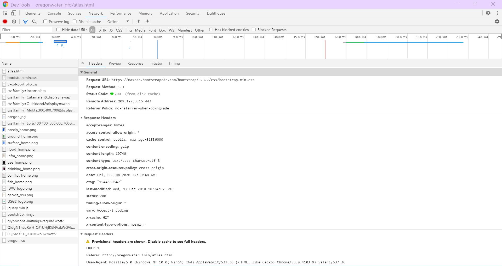

# About Geo-Narratives

#### Background
Going upto the 4th century, the storytelling in the world of maps was a key function to make people imagine the new world they have never been. It is mostly coming up with a very fascinating topic and several maps. Even though the Internet changed so many things in Geography, the geo-narrative is still necessary for geographers in various fields to **tell a story** because the visuals strengthen their voices.

According to Esri, the world biggest GIS software supplying company, the storymap as one of the tools in geo-narratives is mostly targeting the general, nontechnical qudience. People usually approaches the topic of interest by reading the geo-narrative and looking at the affluent visuals such as maps, videos, images, and tables. Thus, the geo-narratives are the *initial meeting place* for authors and audiences.

Storymap.js is a very important java library for the authors especially for those who have little experience with programming. It helps authors to create the story map applications with designing web interface, map, and structures.

#### Example: Oregon Water Atlas
As an example for this project, I referred the <a href="http://oregonwater.info/atlas.html">*Oregon Water Atlas*</a> contributed by Institute For Water & Watershed, Oregon State University Cartography & Geovisualization, and USGS. It contains 9 atlases related to Oregon's annual water changes.

Chrome Developer tool is very useful in inspecting what is going on while the users look around the web page. I was focusing on the FIRST page of the example instead of capturing all the developer tool screens for 9 atlases due to the word limits.

Among the 8 different sections in the tool, the **Network** section is sort of answering the questions about the *systematic architecture*.

The section is telling that the `atlas.html` works as the client since it is requesting other files to be downloaded from the servers.

I set to view the domain of each files loaded while I was hovering the web page. This step enabled me to find some files whose domain is different from `atlas.html`. One of them was `bootstrap.min.css`, a stylesheet from maxcdn.bootstrapcdn.com

Including the bootstrap, there were a couple more such as fonts.googleapis.com and fonts.gstatic.com.

Another section tab for **Sources** is showing another fascinating relationships among the files loaded for this web map.

From the Sources, it is able to assume that oregonwater.info is a Web Client which owns the major html file, css file, and photos. The major libraries in use of this example are `jquery.min.js` from ajax.googleapis.com and `bootstrap.min.js` from maxcdn.bootstrapcdn.com since they both form the basic structures of the atlase and set the responsive reactions for the users. However, you can find more sources and data loaded when clicking each of 9 atlases.

Here, I attached a table of the data sources respectively for the infrastructure and surface water.
|         | infrastructure                                               | surface water                                                      |
|---------|--------------------------------------------------------------|--------------------------------------------------------------------|
| Vectors | basemaps.cartocdn.com                                        | basemaps.cartocdn.com                                              |
| Rasters | geoserver.library.oregonstate.edu server.arcgisonline.com | geoserver.library.oregonstate.edu mapious.ceoas.oregonstate.edu |

#### Web Map

The web map for Dams of the infrastructure atlas is a very well-constructed web map. It has two basemaps: ArcGISonline WorldImagery for the smaller scale and Light_all basemap for the larger scale at the lower-right side. Some interactive features the map has are hovering on the proportional symbols to view the summary of the dams and drawing different sizes of squre on the larger scale map followed by the zooming in an out of the main map.

Web map elements in Dams
- Legends for the symbols
- Zoom In/Out Buttons

#### Analysis
Strengths I found from the example (and probably the project) are...
- Being simple and easy to view the data at once
  - Organized view
  - Various colors and fonts
- Giving geographic understanding to the audience through Maps
- Using several types of media

Weaknesses I found from the example (and probably the project) are...
- Not enough explanation
  - limited space for text
- Being a method of occuring the **digital divide**

As mentioned at the beginning, the targeting audience of this project is mostly the general, common people having interested in the topic. In other words, it means there are a lot of people in different age groups, different infrastructures, etc. The digital divide might be caused while accessing the geo-narrative published on the Internet, only allowing a pinch of people to open the web page and see the visuals. This is very important when considering that this small part would influence on their rights on knowledge or education.

It has no doubt that geo-narratives are becoming a good way of representing and sharing the ideas. However, it is not the best one. If the prospective users of this project take care of those weaknesses and improve them, geo-narratives' good impacts will bring more benefits to more people.
